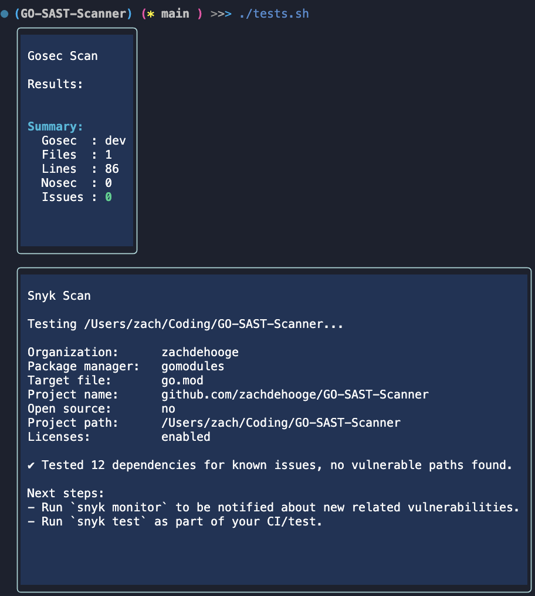

# GO-SAST-Scanner

- An application to faciliate the SAST scanning of Golang applications against gosec and snyk

## Installation
- `go install github.com/zachdehooge/GO-SAST-Scanner`
- Install the latest version of Snyk `npm install snyk -g`
- Use `Snyk auth`
- Now you can use the `GO-SAST-Scanner snyk` command
  - Command Options:
    - gosec
    - snyk
- Run `tests.sh` to execute all commands
##

